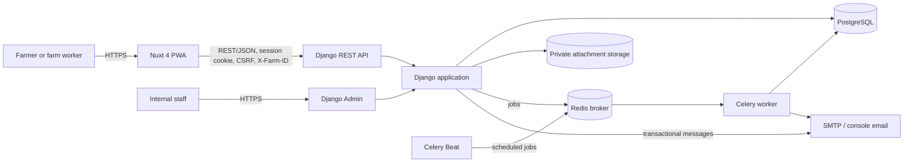
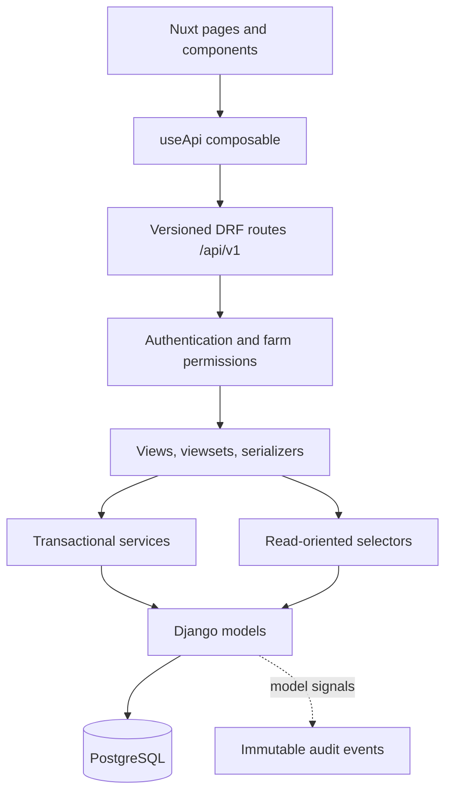

# System Architecture

## Purpose and Scope

Flockwise is a multi-farm livestock management platform for sheep and goats. It supports animal identity and lifecycle, health, husbandry, reproduction, growth, medicine, nutrition, files, reporting, imports, notifications, teams, and audit history. The primary client is an installable Nuxt Progressive Web App (PWA); Django Admin is an internal operational interface.

The system is a **modular monolith**. Business capabilities are separated in code but share one Django process and PostgreSQL database. This keeps cross-domain transactions simple and avoids distributed-system overhead while the product is evolving.

## Runtime Context

Docker Compose runs PostgreSQL, Redis, the Django API, Nuxt web server, Celery worker, and Celery Beat locally. Production infrastructure is deliberately not fixed yet.

## Application Layers

- **Nuxt pages/components** own presentation, responsive interaction, and form state.
- **`useApi`** centralises credentials, CSRF tokens, selected-farm headers, and downloads.
- **DRF views/serializers** translate HTTP input and output and perform request-level validation.
- **Permissions** authenticate users and establish the active farm boundary.
- **Services** coordinate multi-record writes and transactions; selectors encapsulate non-trivial reads.
- **Models** define durable structure and database constraints.

## Backend Modules

| Module | Responsibility |
| --- | --- |
| `accounts` | Users, signup, session login/logout, and password recovery |
| `farms` | Farms, memberships, invitations, roles, and tenant selection |
| `animals` | Flocks, animals, status changes, transfers, and lifecycle history |
| `health` | Observations and standalone treatment records |
| `husbandry` | Scheduled and recurring husbandry tasks |
| `reproduction` | Breeding, pregnancy state, expected dates, and birth outcomes |
| `growth` | Weight measurements and growth summaries |
| `medicine` | Products, batches, courses, dose usage, stock, and withdrawal dates |
| `nutrition` | Feed inventory and flock feeding plans |
| `attachments` | Private farm and animal file metadata and storage |
| `imports` | CSV preview, validation, commit, and error history |
| `notifications` | Task reminders, unread state, and email delivery |
| `reports` / `dashboard` | Cross-module projections and CSV exports |
| `audit` | Append-only change history for tracked farm records |
| `common` | Shared UUID and timestamp model base |

Modules may reference core farm and animal entities, but should avoid circular business workflows. A new deployment unit is justified only by measured scaling, reliability, security, or ownership needs.

## Request, Authentication, and Tenancy Flow

1. Django authenticates the session cookie. Unsafe requests also require a valid CSRF token.
2. The Nuxt client sends the selected farm UUID in `X-Farm-ID`.
3. `selected_farm()` resolves only farms where the user has an active membership. Missing, invalid, and inaccessible farm IDs return the same not-found response.
4. Role permissions allow reads to active members. Writes normally allow owners, managers, and workers; sensitive inventory, reports, imports, audit, and team operations require owners or managers.
5. Farm-scoped viewsets inject the resolved farm into serializer context and new records. Querysets must still filter explicitly by that farm.

Tenant isolation is an application-level control backed by a `farm_id` on nearly every domain record. PostgreSQL row-level security is not currently used. Tests must cover cross-farm access for every new workflow.

## Consistency and Domain Events

Multi-record workflows use `transaction.atomic()`. Row locks protect race-sensitive operations such as accepting invitations, changing animal lifecycle state, and decrementing medicine stock. Important examples include:

- creating an owner membership with a farm;
- updating an animal and appending its lifecycle event together;
- completing a birth and closing its breeding record together;
- recording a dose, decrementing a batch, updating withdrawal dates, and completing a course;
- completing a recurring task and creating its next occurrence.

Audit signals capture create, update, and delete operations for tracked farm models when an authenticated request has matching farm context. Audit events are immutable, but they are operational history rather than an event-sourced system of record.

## Background Work and Notifications

Celery Beat schedules reminder generation hourly. The service finds due or overdue husbandry tasks, creates one notification per recipient/task/kind, and queues email delivery only after the database transaction commits. The unique notification constraint makes repeated reminder scans idempotent.

## Files, PWA, and External Boundaries

Attachment metadata is stored in PostgreSQL; file content is stored under Django media storage. Downloads require active farm membership, and production storage can later move behind the same storage interface.

The PWA precaches only the application shell and static assets. API responses and private media are not cached, so livestock data requires a network connection. External boundaries currently comprise SMTP, file storage, and the browser; OAuth, tracking devices, and a knowledge assistant remain deferred integrations.

## Evolution Rules

- Keep REST endpoints versioned under `/api/v1/` and update the OpenAPI schema with contract changes.
- Put cross-record writes in services and complex projections in selectors.
- Scope all farm-owned reads and writes to the active membership.
- Prefer database constraints for invariants expressible within one table; validate cross-table rules in application services or serializers.
- Add migrations for every schema change and an ADR for significant architectural decisions.
- Never place clinical diagnosis or automatic treatment decisions in generic recommendation features without an explicit safety design and professional review.
