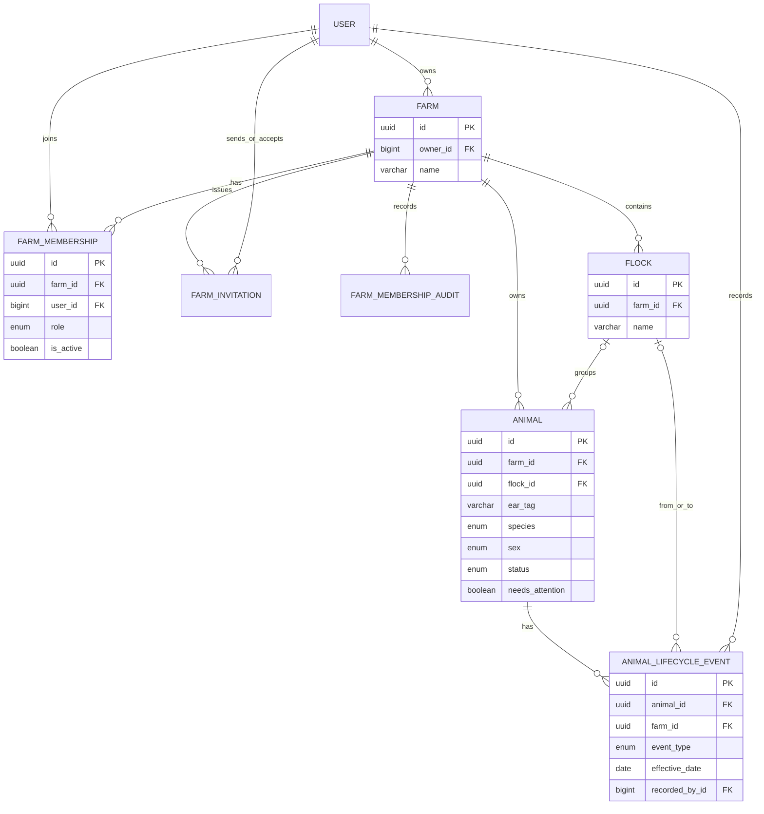
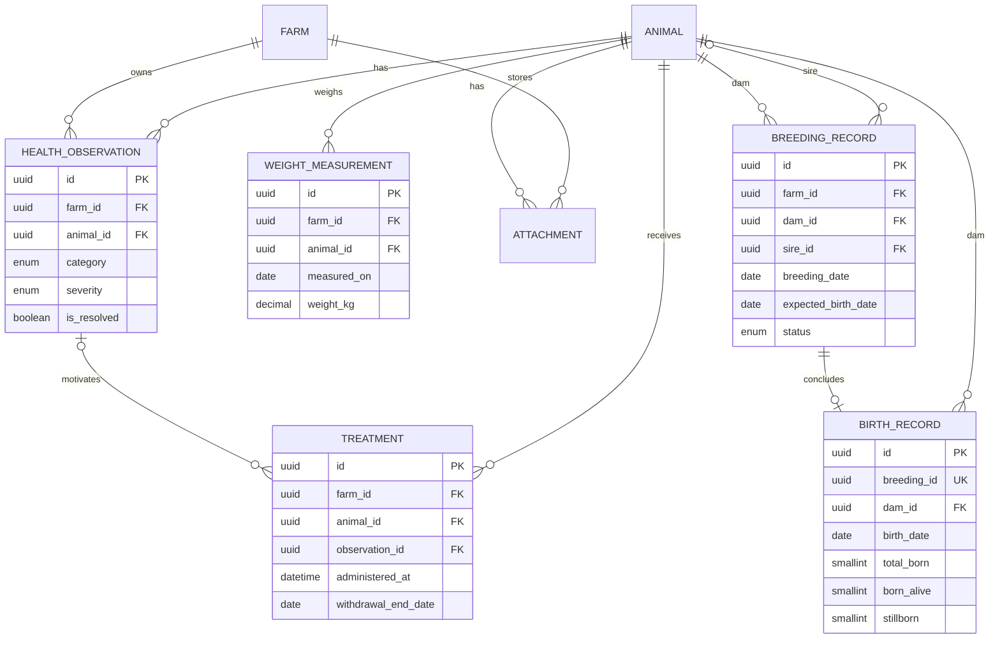
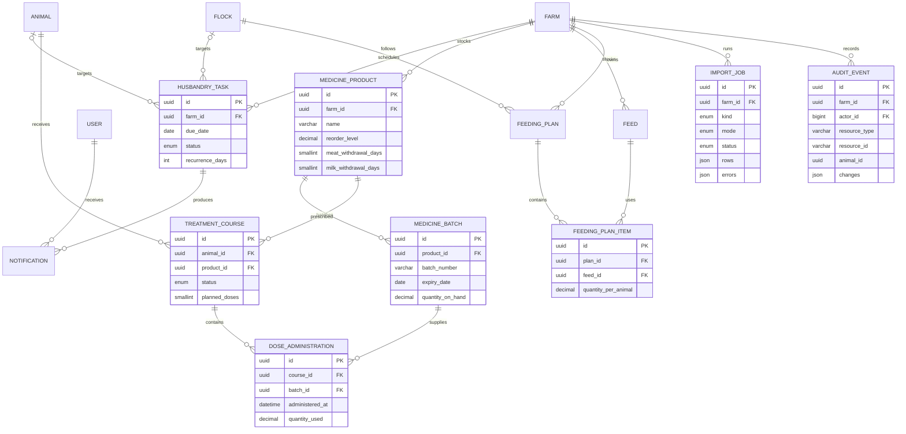

# Database Design

## Overview

PostgreSQL is the system of record. Django migrations own the schema. `accounts.User` extends Django's standard user model; other persistent domain models inherit `TimeStampedModel`, which provides a UUID primary key plus `created_at` and `updated_at` timestamps.

Most business tables carry a direct `farm_id`. This intentional denormalisation makes tenant filters and indexes simple, but code must verify that related objects belong to the same farm. `FeedingPlanItem` is the notable exception: its farm is derived through its plan.

## Tenancy and Livestock Core

`FarmMembership` is the authorisation join between a user and farm. Roles are owner, manager, worker, and viewer. `Farm.owner` identifies the founding/primary owner while memberships drive access control. Animal lifecycle state is stored on `Animal` for current queries and appended to `AnimalLifecycleEvent` for history.

## Animal History and Reproduction

`Treatment` is a lightweight historical health entry. Structured medicine inventory and multi-dose workflows use the separate treatment-course model below. A breeding can have at most one birth. The service copies the breeding dam onto the birth for efficient history and enforces that birth totals reconcile.

## Operations, Inventory, and Supporting Records

`AuditEvent.resource_id` and `animal_id` are intentionally not foreign keys: audit history remains readable after a tracked resource or user is deleted. The actor is nullable and becomes `NULL` when the user is removed. Attachment file bytes are likewise outside PostgreSQL; the attachment row stores ownership, metadata, and the storage path.

## Key Constraints

| Constraint | Purpose |
| --- | --- |
| Unique `(farm, user)` membership | One role-bearing membership per user and farm |
| Unique invitation token | Unguessable invitation lookup |
| Unique `(farm, name)` for flocks, feeds, and medicine products | Tenant-local naming |
| Unique `(farm, ear_tag)` animal | Ear tags may repeat only across farms |
| Unique `(animal, measured_on)` weight | At most one official weight per animal per day |
| One-to-one birth to breeding | A breeding has at most one recorded outcome |
| Unique `(product, batch_number)` medicine batch | Identifies physical stock lots |
| Unique `(plan, feed)` feeding item | A feed appears once per plan |
| Unique `(recipient, task, kind)` notification | Idempotent reminder generation |

Cross-table rules that SQL constraints do not currently express are enforced in serializers and transactional services. Examples include same-farm relationships, species/sex eligibility for breeding, matching dose products and batches, sufficient stock, valid birth totals, valid feeding-plan dates, and retaining at least one active farm owner.

## Index Strategy

Indexes lead with `farm_id` on common tenant queries and then include status, species, date, recipient, category, or resource type as appropriate. This supports dashboards, due-task scans, timelines, inventory alerts, reports, and audit filtering without global table scans. Foreign keys and unique constraints also receive PostgreSQL indexes through Django.

When query behavior changes, inspect generated SQL and production-like data before adding an index. Avoid indexing low-selectivity fields alone, and remove indexes shown to be redundant.

## Delete and Retention Behavior

- Deleting a farm cascades through most operational data, but protected audit records and the protected owner relationship can prevent unsafe deletion.
- Removing a flock sets an animal's current flock to `NULL`; historical lifecycle flock references also use `SET_NULL`.
- Health observations, weights, attachments, and tasks cascade with their animal; breeding participants, birth records, and treatment courses protect referenced animals.
- Products, batches, courses, and dose administrations use `PROTECT` where deletion would invalidate medicine history.
- Recorded-by and administered-by relationships generally use `PROTECT`; audit actors use `SET_NULL`.
- `AuditEvent` overrides update and delete operations and is append-only through the application.

Retention periods and archival procedures are not yet defined. Production readiness must establish backup, restore, retention, privacy, and attachment-storage policies before live farm data is hosted.

## Schema Change Process

1. Change the Django model and associated validation/service rules.
2. Create a named migration with `python manage.py makemigrations`.
3. Review SQL and deletion behavior, especially for populated tables.
4. Add tests for constraints, farm isolation, and data migration behavior.
5. Run `python manage.py migrate` and the full backend test suite.
6. Update this document when entities, relationships, or material invariants change.
